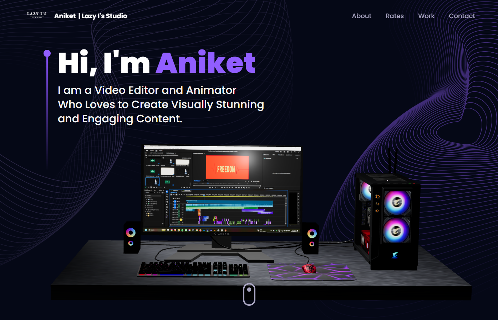
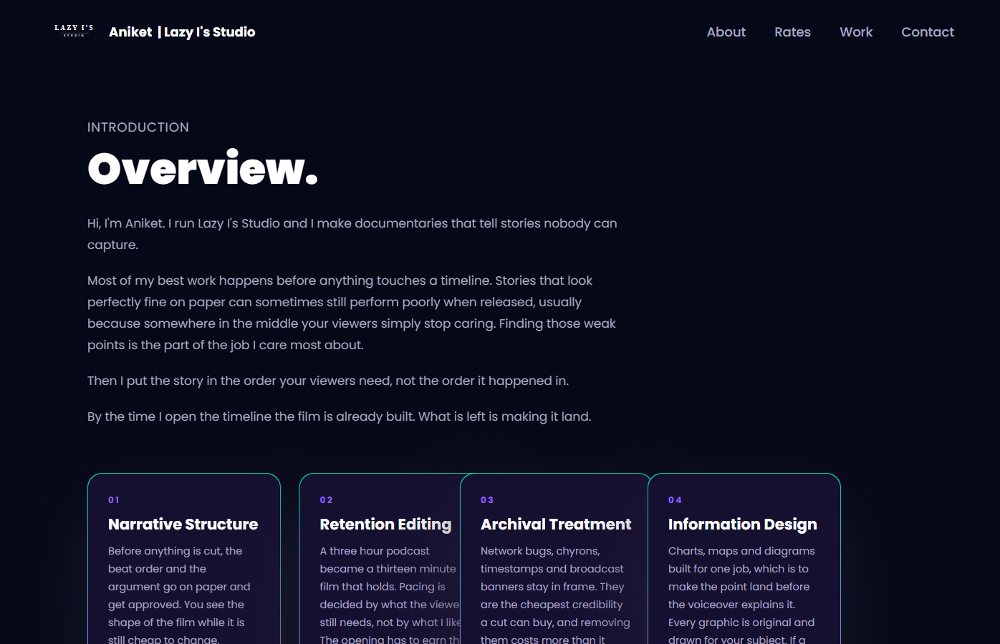
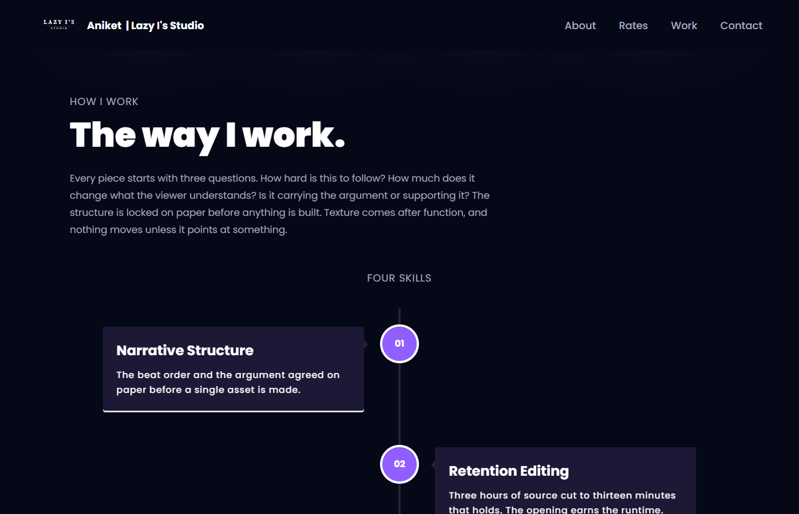
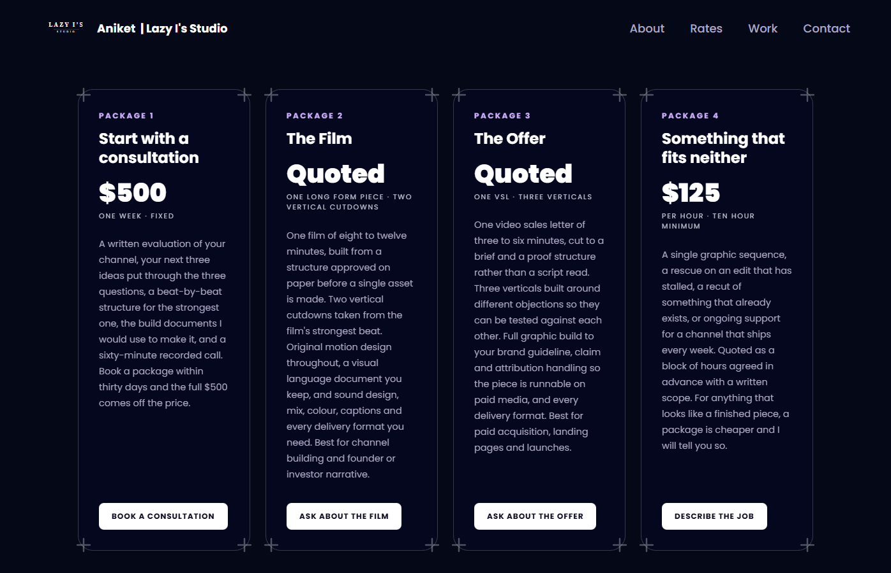
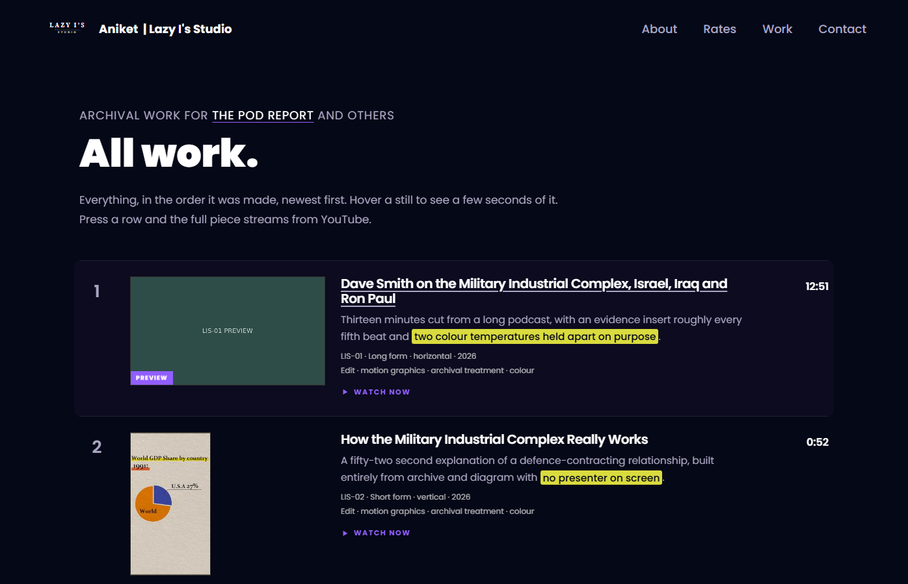
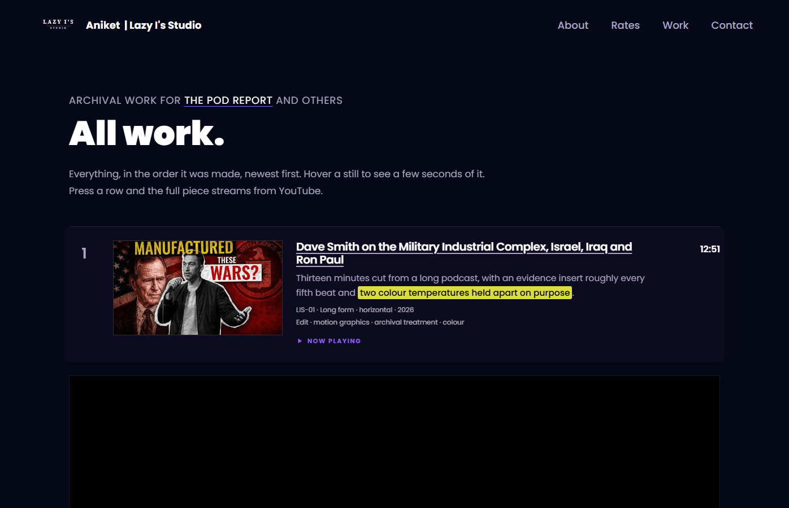
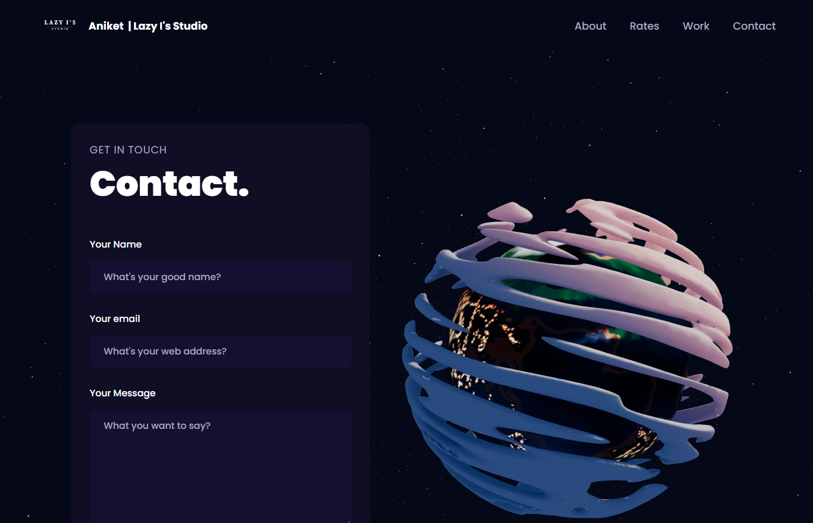
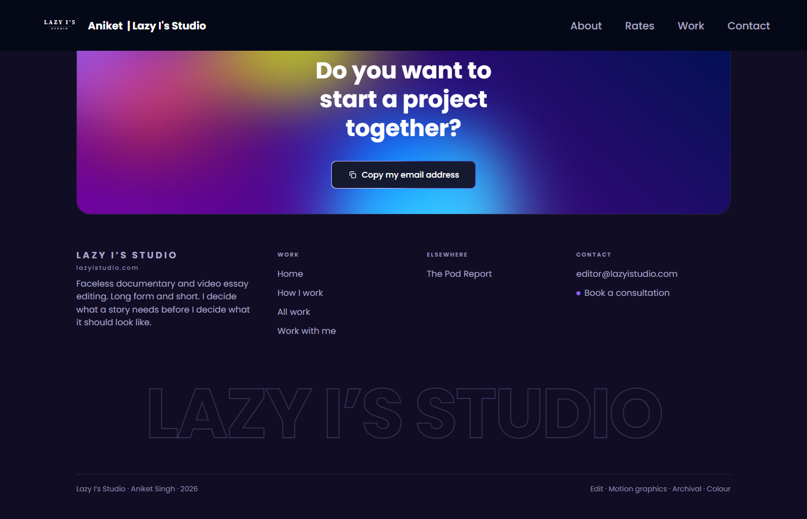

# Lazy I's Studio · Aniket Singh

A 3D portfolio site for Aniket Singh, video editor and animator, trading as
**Lazy I's Studio**. Faceless documentary and video-essay editing, long form
and short.

Built with React, Vite, Tailwind CSS, Three.js and Framer Motion, on the
structure of the JavaScript Mastery 3D portfolio tutorial. The copy, rate
card and work index are carried over from [lazyistudio.com](https://lazyistudio.com).



## What is on the page

| Section | What it does |
| --- | --- |
| **Hero** | Headline over a 3D desktop model. The monitor shows a Premiere Pro timeline. The model recovers on its own if the GPU drops the WebGL context. |
| **Overview** (`#about`) | Who Aniket is and how he works, with four skill cards: Narrative Structure, Retention Editing, Archival Treatment, Information Design. |
| **The way I work** (`#rates`) | The three questions every piece starts with, the four skills as a vertical timeline, and a four-card rate card: consultation, The Film, The Offer, and custom hourly work. Every card links to a prefilled email. |
| **All work** (`#work`) | Every piece, newest first. Posters come from YouTube's CDN. Hovering a still plays a short muted loop. Pressing a row opens the full piece in an inline YouTube player. |
| **Contact** (`#contact`) | EmailJS form beside a rotating 3D planet. |
| **Footer** | A "start a project together" tile with a copy-my-email button, then the same link columns and wordmark as lazyistudio.com. |

## Screenshots

| | |
| --- | --- |
|  |  |
| Overview with the four skill cards | The way I work, with the skills timeline |
|  |  |
| Rate card | All work, with a hover preview playing |
|  |  |
| A piece opened in the inline player | Contact |
|  | |
| Footer with the copy-email tile | |

## Running it

Requires Node 18 or newer.

```bash
npm install
npm run dev
```

Then open <http://localhost:5173>. `npm run build` writes a production bundle to
`dist/`, and `npm run preview` serves that bundle locally.

The project pins the tutorial's dependency versions. `react-tilt` 0.1.4 only
declares React 16 as a peer, so `.npmrc` sets `legacy-peer-deps=true` and plain
`npm install` works without extra flags.

### Contact form

The form sends through [EmailJS](https://www.emailjs.com/). Create a `.env`
file in the project root with your own keys:

```
VITE_APP_EMAILJS_SERVICE_ID=your_service_id
VITE_APP_EMAILJS_TEMPLATE_ID=your_template_id
VITE_APP_EMAILJS_PUBLIC_KEY=your_public_key
```

Without them the form renders but sending fails.

## Editing the content

Almost everything you would want to change lives in one file,
[`src/constants/index.js`](src/constants/index.js):

- `navLinks`: the navbar.
- `EMAIL` and `POD_REPORT`: the contact address and the channel link used across the site.
- `services`: the four cards under the overview.
- `skills`: the four timeline entries.
- `packages`: the rate card. Title, price, terms, description, button label and the prefilled `mailto:` link.
- `works`: the work index. Each entry needs a `slug`, `ref`, `title`, `format`, `duration`, `year`, `aspect` (`16/9` or `9/16`), `role`, `lede`, an optional `marked` phrase inside the lede that gets the yellow highlight, the `youtube` video ID, and an `added` date that controls ordering. `preview` is an optional list of short muted loop files under `public/media`, `.webm` first and `.mp4` second.

The overview paragraphs are in [`src/components/About.jsx`](src/components/About.jsx)
and the "way I work" paragraphs in [`src/components/Experience.jsx`](src/components/Experience.jsx).

### Preview loops

The only video this site serves itself is the short loop behind each still.
Keep them 3 to 5 seconds, 480p, no audio track, under 200 KB each. The loop
does not download until the cursor has rested on the still for 180 ms. The
loops currently in `public/media` are the placeholders from lazyistudio.com.

### The monitor screen

The screen on the 3D desktop is the texture
`public/desktop_pc/textures/Material.074_30_baseColor.png`. Replace it with any
1920 by 1080 image saved **upside down**, which is how the model's UV map
expects it.

## Project layout

```
src/
  components/
    Navbar.jsx  Hero.jsx  About.jsx  Experience.jsx  Works.jsx
    Contact.jsx  Footer.jsx  CopyEmailButton.jsx  Loader.jsx
    canvas/      Computers.jsx  Earth.jsx  Stars.jsx
    ui/          MagicButton.jsx  GradientBg.jsx
  constants/     index.js        all site content
  hoc/           SectionWrapper.jsx
  utils/         motion.js       Framer Motion variants
  assets/        images and the navbar logo
  styles.js      shared Tailwind class strings
  index.css      Tailwind directives, gradients, footer and preview styles
public/
  desktop_pc/    the 3D desktop model and textures
  planet/        the 3D planet model
  media/         hover preview loops
  logo.svg       favicon
docs/screenshots/
```

## Stack

React 18 · Vite 4 · Tailwind CSS 3.2 · Three.js 0.149 with
@react-three/fiber 8 and @react-three/drei 9 · Framer Motion 9 ·
react-vertical-timeline-component · react-tilt · EmailJS

## Credits

Site structure from the JavaScript Mastery 3D portfolio tutorial. The
copy-email button and gradient tile are adapted from Aceternity UI components.
The desktop and planet models are from Sketchfab under their bundled licences,
see the `license.txt` files in `public/desktop_pc` and `public/planet`.

Lazy I's Studio · Aniket Singh · 2026
